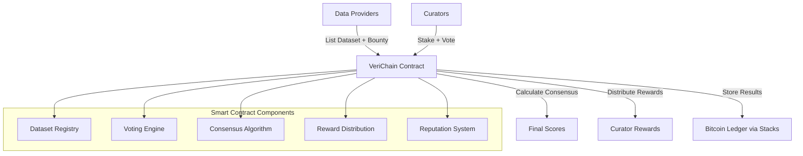

# VeriChainAI

> A decentralized AI dataset verification and curation platform built on the Stacks blockchain

[](https://stacks.co)
[](https://clarity-lang.org/)
[](https://bitcoin.org)

## 📋 Table of Contents

- [Overview](#overview)
- [Problem Statement](#problem-statement)
- [Solution](#solution)
- [Features](#features)
- [Architecture](#architecture)
- [Getting Started](#getting-started)
- [Smart Contract](#smart-contract)
- [Usage](#usage)
- [Testing](#testing)
- [Deployment](#deployment)
- [Contributing](#contributing)
- [Roadmap](#roadmap)
- [License](#license)

## 🌟 Overview

VeriChainAI tackles the critical "garbage in, garbage out" problem in the AI industry by creating a decentralized curation marketplace where stakeholders can collectively assess and validate AI datasets. Built on Stacks and secured by Bitcoin, it provides immutable provenance tracking and cryptoeconomic consensus for AI data quality.

## 🎯 Problem Statement

The AI industry faces several critical challenges:

- **Opaque Data Provenance**: Training data sources are often unclear or undocumented
- **Quality Inconsistency**: No standardized way to assess dataset quality
- **Copyright Issues**: Models trained on copyrighted material without proper attribution
- **Bias Propagation**: Biased datasets lead to biased AI models
- **Trust Deficit**: No trustless mechanism to verify data quality and lineage

## 💡 Solution

VeriChainAI creates a **cryptoeconomic consensus mechanism** where:

1. **Data Providers** list datasets with bounties to incentivize validation
2. **Curators** stake STX tokens to vote on dataset quality across multiple dimensions
3. **Consensus Algorithm** calculates weighted scores based on stake amounts
4. **Reward System** compensates accurate curators and penalizes bad actors
5. **Immutable Record** stores all ratings and provenance data on Bitcoin via Stacks

## ✨ Features

### 🗄️ Dataset Registry
- Decentralized dataset listing with IPFS/Gaia storage
- Bounty system to incentivize quality curation
- Duplicate prevention and metadata validation
- Provider tracking and management

### 🗳️ Stake-Based Voting
- Multi-dimensional scoring system:
  - **Quality Score**: Overall dataset quality
  - **Accuracy Score**: Data accuracy and correctness
  - **Bias Score**: Bias assessment and fairness
  - **Documentation Score**: Completeness of documentation
  - **License Clarity Score**: Legal compliance and licensing
- Minimum stake requirements (0.5 STX)
- Time-bound voting periods (14 days)
- Duplicate vote prevention

### 🎯 Consensus & Rewards
- Weighted consensus calculation using stake amounts
- Automatic reward distribution after voting period
- **110% rewards** for consensus-aligned voters
- **20% slashing** for outlier votes (bad actors)
- Platform fee mechanism (2.5%)

### 📊 Reputation System
- Curator reputation tracking based on voting accuracy
- Historical performance metrics
- Success rate calculations
- Total rewards earned tracking

## 🏗️ Architecture



## 🚀 Getting Started

### Prerequisites

- [Node.js](https://nodejs.org/) (v18+)
- [Clarinet](https://github.com/hirosystems/clarinet) (v2.0+)
- [Stacks CLI](https://docs.stacks.co/docs/command-line-interface)

### Installation

1. **Clone the repository**
   ```bash
   git clone https://github.com/yourusername/verichainai.git
   cd verichainai
   ```

2. **Navigate to the project directory**
   ```bash
   cd verichain_ai
   ```

3. **Install dependencies**
   ```bash
   npm install
   ```

4. **Check Clarinet installation**
   ```bash
   clarinet --version
   ```

### Local Development

1. **Start Clarinet console**
   ```bash
   clarinet console
   ```

2. **Run tests**
   ```bash
   npm test
   ```

3. **Watch for changes**
   ```bash
   npm run test:watch
   ```

## 📜 Smart Contract

The VeriChainAI smart contract (`verichainai.clar`) implements the core functionality:

### Key Constants
- `MIN-BOUNTY-AMOUNT`: 1 STX minimum bounty
- `MIN-STAKE-AMOUNT`: 0.5 STX minimum stake
- `VOTING-PERIOD-BLOCKS`: 2,016 blocks (~14 days)
- `CONSENSUS-THRESHOLD`: 10% deviation for consensus
- `SLASHING-RATE`: 20% penalty for bad actors

### Main Functions

#### Data Provider Functions
- `(list-dataset)`: List a new dataset with bounty
- `(get-provider-datasets)`: Get datasets by provider

#### Curator Functions  
- `(stake-and-vote)`: Stake STX and vote on dataset quality
- `(get-curator-reputation)`: Get curator's reputation score

#### System Functions
- `(finalize-dataset)`: Calculate consensus and distribute rewards
- `(get-final-scores)`: Get final consensus scores

### Data Structures

```clarity
;; Dataset structure
{
  provider: principal,
  dataset-hash: (buff 64),
  metadata-uri: (string-ascii 255),
  bounty-amount: uint,
  created-at: uint,
  status: (string-ascii 20),
  total-stake: uint,
  vote-count: uint
}

;; Vote structure
{
  stake-amount: uint,
  quality-score: uint,
  accuracy-score: uint,
  bias-score: uint,
  documentation-score: uint,
  license-clarity-score: uint,
  justification: (string-ascii 500),
  voted-at: uint
}
```

## 🔧 Usage

### 1. List a Dataset

```clarity
;; List a dataset with 5 STX bounty
(contract-call? .verichainai list-dataset 
  0x1234... ;; dataset hash
  u5000000  ;; 5 STX bounty
  "ipfs://QmABC..." ;; metadata URI
)
```

### 2. Vote on Dataset Quality

```clarity
;; Stake 1 STX and vote
(contract-call? .verichainai stake-and-vote
  u1        ;; dataset ID
  u1000000  ;; 1 STX stake
  u85       ;; quality score (0-100)
  u90       ;; accuracy score
  u75       ;; bias score  
  u95       ;; documentation score
  u80       ;; license clarity score
  "High quality dataset with good documentation"
)
```

### 3. Finalize and Distribute Rewards

```clarity
;; Anyone can call after voting period ends
(contract-call? .verichainai finalize-dataset u1)
```

### 4. Query Results

```clarity
;; Get final consensus scores
(contract-call? .verichainai get-final-scores u1)

;; Get curator reputation
(contract-call? .verichainai get-curator-reputation 'SP1ABC...)
```

## 🧪 Testing

Run the comprehensive test suite:

```bash
# Run all tests
npm test

# Run with coverage
npm run test:report

# Watch mode for development
npm run test:watch
```

### Test Coverage

- ✅ Dataset listing and validation
- ✅ Staking and voting mechanisms  
- ✅ Consensus calculation
- ✅ Reward distribution
- ✅ Reputation tracking
- ✅ Error handling and edge cases

## 🚀 Deployment

### Testnet Deployment

1. **Configure Testnet**
   ```bash
   clarinet deployments generate --testnet
   ```

2. **Deploy Contract**
   ```bash
   clarinet deployments apply --testnet
   ```

### Mainnet Deployment

1. **Configure Mainnet**
   ```bash
   clarinet deployments generate --mainnet
   ```

2. **Deploy Contract**
   ```bash
   clarinet deployments apply --mainnet
   ```

## 🤝 Contributing

We welcome contributions! Please see our [Contributing Guidelines](CONTRIBUTING.md).

### Development Process

1. Fork the repository
2. Create a feature branch (`git checkout -b feature/amazing-feature`)
3. Make your changes
4. Add tests for new functionality
5. Ensure all tests pass (`npm test`)
6. Commit your changes (`git commit -m 'Add amazing feature'`)
7. Push to the branch (`git push origin feature/amazing-feature`)
8. Open a Pull Request

## 🗺️ Roadmap

### Phase 1 (Current) - MVP
- [x] Core dataset registry
- [x] Staking and voting mechanism
- [x] Consensus calculation and rewards
- [x] Basic reputation system

### Phase 2 - Enhanced Features
- [ ] Frontend dApp interface
- [ ] Advanced reputation algorithms
- [ ] Dataset categories and filtering
- [ ] Integration with popular AI platforms

### Phase 3 - Ecosystem Expansion  
- [ ] AI model validation and auditing
- [ ] Native governance token (VERI)
- [ ] Validation challenges and disputes
- [ ] Advanced analytics and insights

### Phase 4 - Enterprise Integration
- [ ] API for external platforms
- [ ] Enterprise dashboard
- [ ] Compliance and regulatory features
- [ ] Advanced oracle integrations

## 📊 Key Metrics

Track the platform's success through:

- **Total Value Locked (TVL)**: STX staked in the system
- **Dataset Quality Score**: Average consensus scores
- **Curator Accuracy**: Percentage of consensus-aligned votes  
- **Platform Usage**: Number of datasets and active curators
- **Reputation Distribution**: Health of curator ecosystem

## 🛡️ Security

VeriChainAI implements multiple security measures:

- **Staking Requirements**: Economic friction prevents spam
- **Time-based Voting**: Prevents rush decisions
- **Consensus Mechanisms**: Reduces manipulation risk
- **Slashing Penalties**: Disincentivizes bad behavior
- **Bitcoin Security**: Immutable record on Bitcoin ledger

## 📄 License

This project is licensed under the MIT License - see the [LICENSE](LICENSE) file for details.

## 🙏 Acknowledgments

- **Stacks Foundation** for blockchain infrastructure
- **Bitcoin** for ultimate security and decentralization
- **Clarity Language** for safe and predictable smart contracts
- **Open Source AI Community** for inspiration and feedback

---

**Built with ❤️ for the future of trustworthy AI**

For questions, suggestions, or support, please [open an issue](https://github.com/yourusername/verichainai/issues) or join our community discussions.